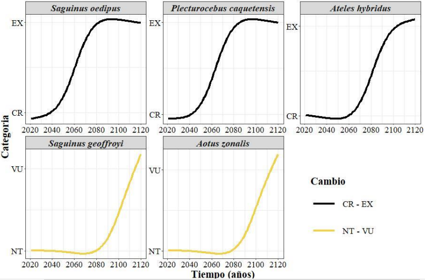
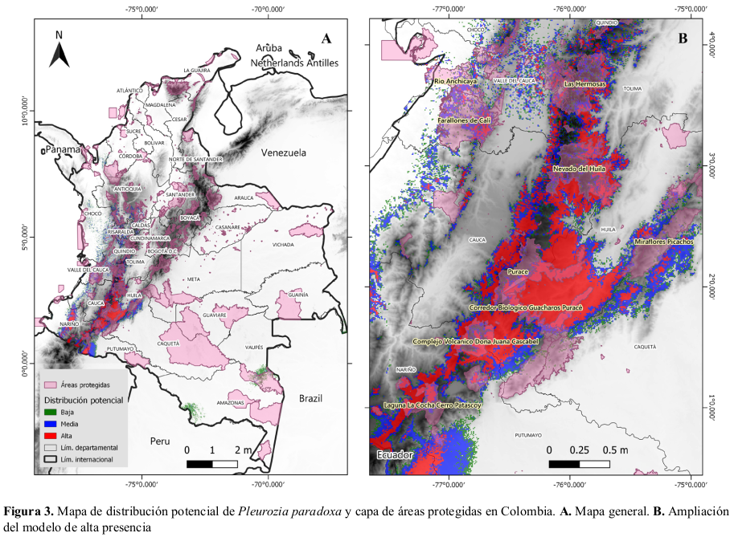

# Portafolio
---
## Ciencia de datos
---
## Tesis

 En este apartado, presento los trabajos de investigación realizados en las diferentes etapas de mi carrera profesional con el fin de optar por los titulos de Licenciado en Biología y Magíster en Bioestadística de la <a href="http://licbiologia.udistrital.edu.co:8080/"> Universidad Distrital Francisco José de Caldas</a> y la <a href="https://umb.edu.co/programa/maestria-en-bioestadistica/"> Universidad Manuela Beltrán</a> respectivamente.

 

### **Futuras extinciones de los primates Colombianos:**

  
 

Colombia destaca como el tercer país con mayor diversidad de primates. De los 40 taxones identificados, 21 de ellos están en peligro de extinción según la clasificación de la Unión Internacional para la Conservación de la Naturaleza (IUCN). A pesar de los valiosos esfuerzos en la conservación de estas especies en Colombia, estos, resultan insuficientes para protegerlas de manera efectiva. Por tanto, se torna esencial comprender los posibles procesos que pueden llevar a la extinción, con el objetivo de fortalecer y ampliar las medidas de conservación.

Con el propósito de prever las transiciones entre las categorías de conservación y la pérdida de diversidad de primates en Colombia en los próximos 100 años, se empleó el paquete de R de código abierto llamado iucnsim. Este análisis incorporó datos de masa corporal y duración de generaciones como componentes clave para evaluar las futuras transiciones en las categorías de conservación de la IUCN, calcular los tiempos y tasas de extinción de las especies de primates colombianos.

Se estima que, en los próximos 100 años, se producirá la pérdida de al menos seis especies. Las especies con una mayor probabilidad de extinción durante este período son <em>Saguinus oedipus</em>, <em>Plecturocebus caquetensis</em> y <em>Ateles hybridus</em>. Este estudio proporciona, por primera vez, información concreta sobre el número de extinciones y las transiciones en las categorías de conservación de los primates colombianos. No obstante, es importante destacar que esta información debe ser utilizada con cautela y considerarse como apoyo para la toma de decisiones relacionadas con las medidas de conservación de los primates en Colombia.

 

### **Distribución potencial de la hepática *Pleurozia paradoxa* en Colombia:**

  
 

La especie <em>Pleurozia paradoxa</em> es una hepática de hábitat generalmente paramuno que se encuentra en estado vulnerable según el libro rojo de briófitas de Colombia debido a su poca presencia y su minúscula área de ocupación en el país. Mediante la aplicación de modelos de distribución de especies podemos estimar áreas de idoneidad que dan cuenta de la presencia probable de una especie. En este caso se usó un algoritmo de aprendizaje de máquinas denominado máxima entropía y el software Maxent, con el fin de obtener mapas de distribución potencial. Se emplearon varios registros de presencia y distintos juegos de variables climáticas para el modelamiento, además de un umbral de maximización de la especificidad y sensibilidad en el mapeo. Como resultado, la distribución potencial de P. paradoxa en Colombia se concentró en los departamentos del Cauca, Huila y Nariño a lo largo de la cordillera Central, extendiéndose levemente hacia el Valle del Cauca y Tolima, y en marcada relación con la altitud y el clima de dichas zonas.

---
